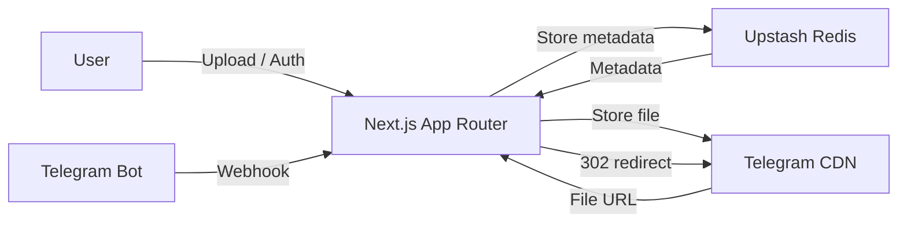

# ⚡ PixEdge: Ultra-Fast Edge Media Hosting

[](https://nextjs.org/)
[](https://upstash.com/)
[](https://telegram.org/)
[](https://opensource.org/licenses/MIT)

**PixEdge** is a professional-grade, open-source media hosting platform built for speed and infinite scalability. It uses the Telegram Bot API as a free, unlimited storage backend and Upstash Redis for metadata — delivering files via edge redirection with zero storage costs.

---

## 🚀 Features

| Feature | Details |
| :--- | :--- |
| 📦 **Unlimited Storage** | Powered by Telegram infrastructure — no storage limits, ever |
| 🏎️ **Edge Delivery** | 302 redirect to Telegram CDN — minimal server bandwidth |
| 👤 **User Accounts** | Email/password, GitHub OAuth, Google OAuth, and Telegram Login |
| 🗂️ **Personal Dashboard** | Manage your uploads, view analytics, generate API keys |
| 🔑 **API Keys** | Generate a personal API key from your dashboard for programmatic access |
| 🔗 **Vanity URLs** | Custom human-readable slugs with collision detection and suggestions |
| ⏳ **Expiry Links** | Set links to auto-expire after 1h, 24h, 7d, or 30d (Redis TTL) |
| 📊 **Analytics** | Per-file view and download counters; platform-wide public stats page |
| 📱 **QR Codes** | Instant QR code for every upload |
| 🤖 **Telegram Bot** | Upload via `@PixEdge_Bot` and link your Telegram account to your web account |
| 📋 **Clipboard Paste** | Paste images directly from your clipboard on the upload page |
| 🖥️ **ShareX Support** | Download a ready-to-use `.sxcu` config from your dashboard |
| 🌙 **Dark / Light Mode** | Theme toggle with persistence |

---

## 🛠️ Tech Stack

- **Framework**: [Next.js 15+](https://nextjs.org/) (App Router)
- **Auth**: [NextAuth.js](https://next-auth.js.org/) — GitHub, Google, Credentials, Telegram
- **Database**: [Upstash Redis](https://upstash.com/)
- **Storage**: [Telegram Bot API](https://core.telegram.org/bots/api)
- **Styling**: Vanilla CSS + [Framer Motion](https://www.framer.com/motion/)
- **API**: Versioned REST JSON API (`/api/v1`)

---

## 🔌 Developer API (v1)

All authenticated endpoints accept either a session cookie **or** an `X-API-Key` header (generate your key at `/dashboard`).

### Authentication
```bash
# Via header
curl -H "X-API-Key: pe_your_key_here" ...

# Or via Bearer token
curl -H "Authorization: Bearer pe_your_key_here" ...
```

### Endpoints

#### Upload Media
**`POST /api/v1/upload`** · `multipart/form-data`

| Field | Type | Required | Description |
| :--- | :--- | :--- | :--- |
| `file` | File | Yes | Image or video (max 20 MB) |
| `customId` | String | No | Custom vanity slug |
| `expiresIn` | Number | No | Seconds until expiry: `3600`, `86400`, `604800`, `2592000` |

```bash
curl -X POST https://your-domain.com/api/v1/upload \
  -H "X-API-Key: pe_your_key" \
  -F "file=@image.jpg" \
  -F "customId=my-screenshot" \
  -F "expiresIn=86400"
```

**Rate limits:** 100 uploads/min for authenticated users · 20/min for anonymous.

#### Get File Metadata
**`GET /api/v1/info/[id]`**

#### List Your Uploads
**`GET /api/v1/list`** · Requires auth

Returns your last 50 uploads with URLs, view/download counts, and expiry timestamps.

#### Delete a File
**`DELETE /api/v1/delete/[id]`** · Requires auth · Ownership enforced

```bash
curl -X DELETE https://your-domain.com/api/v1/delete/my-screenshot \
  -H "X-API-Key: pe_your_key"
```

#### Platform Stats
**`GET /api/stats`** · Public

---

## 🖥️ ShareX Integration

1. Go to your **Dashboard → API Keys** and generate a key.
2. Visit `https://your-domain.com/api/sharex?key=pe_your_key` — this downloads `PixEdge.sxcu`.
3. Open ShareX → **Destinations → Custom Uploaders → Import** → select the file.
4. Set PixEdge as your active image uploader. Done.

---

## 🤖 Telegram Bot Integration

PixEdge includes `@PixEdge_Bot` for direct uploads from Telegram.

### Webhook Setup
After deployment, register the webhook once:
```
https://api.telegram.org/bot<YOUR_BOT_TOKEN>/setWebhook?url=https://your-domain.com/api/webhook/telegram
```

### Commands
- `/start` — Welcome message
- `/upload` or `/tgm` — Upload an image
- `/help` — Usage instructions
- `/link` — Link your Telegram account to your PixEdge web account

### Account Linking
Send `/link` to the bot — it returns a one-time URL. Visit it while logged into your PixEdge account to merge the two identities. After linking, bot uploads are tracked under your account.

---

## ⚙️ Getting Started

### Prerequisites
- A **Telegram Bot Token** (from [@BotFather](https://t.me/botfather))
- A **Telegram Chat ID** (your storage channel — use [@userinfobot](https://t.me/userinfobot))
- An **Upstash Redis** database ([free tier](https://upstash.com/))
- (Optional) GitHub / Google OAuth app credentials for social login

### Environment Variables
```env
# Required
TELEGRAM_BOT_TOKEN=your_bot_token
TELEGRAM_CHAT_ID=your_storage_channel_id
UPSTASH_REDIS_REST_URL=https://...
UPSTASH_REDIS_REST_TOKEN=your_token
NEXT_PUBLIC_BASE_URL=https://your-domain.com
NEXTAUTH_SECRET=a_random_32_char_secret
NEXTAUTH_URL=https://your-domain.com

# Optional — for social login
GITHUB_ID=your_github_oauth_app_id
GITHUB_SECRET=your_github_oauth_app_secret
GOOGLE_CLIENT_ID=your_google_client_id
GOOGLE_CLIENT_SECRET=your_google_client_secret
```

### One-Click Deploy
[](https://vercel.com/new/clone?repository-url=https%3A%2F%2Fgithub.com%2Fgeekluffy%2FPixEdge&env=TELEGRAM_BOT_TOKEN,TELEGRAM_CHAT_ID,UPSTASH_REDIS_REST_URL,UPSTASH_REDIS_REST_TOKEN,NEXT_PUBLIC_BASE_URL,NEXTAUTH_SECRET,NEXTAUTH_URL)

### Local Development
```bash
git clone https://github.com/GeekLuffy/PixEdge.git
cd PixEdge
npm install
# create .env.local with the variables above
npm run dev
```

---

## 📖 Architecture



---

## 🤝 Contributing

PixEdge is open source and welcomes contributions!

1. **Fork** the repo and create a feature branch.
2. **Open an Issue** for bugs or feature requests.
3. **Submit a PR** — UI improvements, API enhancements, and docs are all welcome.
4. **Join the community**: [@EdgeBots](https://t.me/EdgeBots) (updates) · [@EdgeBotSupport](https://t.me/EdgeBotSupport) (support)

---

## 📜 License

MIT License — free to use, modify, and distribute.

---

**Made with ❤️ by [Geekluffy](https://github.com/geekluffy)**
